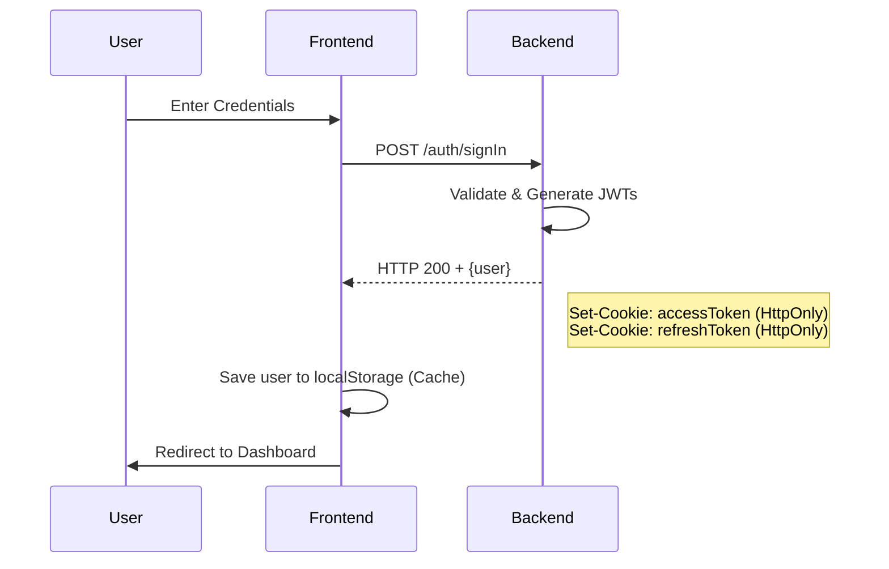
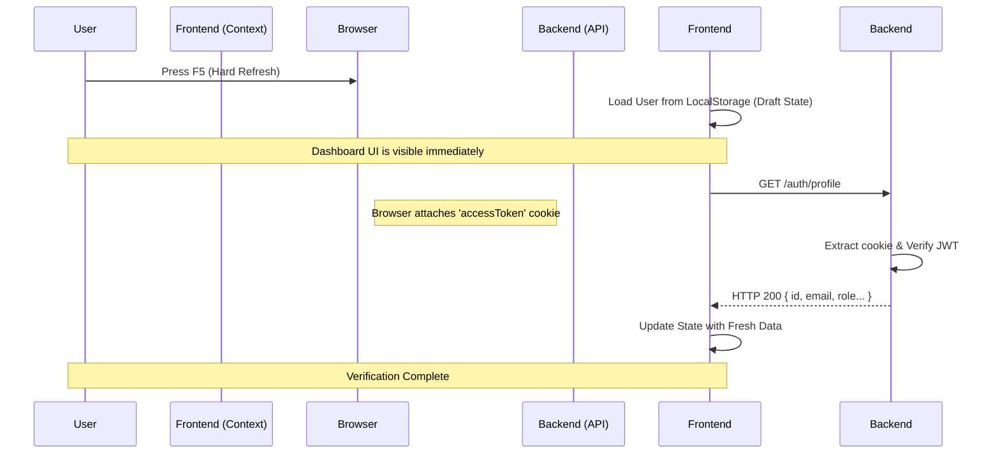
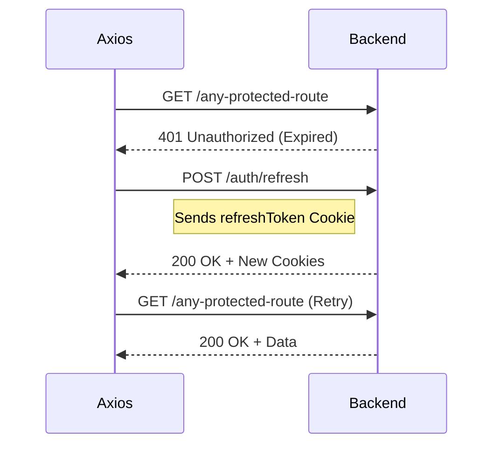

# Authentication System Documentation

This document explains the secure, cookie-based authentication flow implemented in the SecureAuth system.

## Overview
The system uses **HTTP-Only Cookies** for token storage. This prevents Cross-Site Scripting (XSS) attacks from stealing tokens, as the JavaScript code cannot access these cookies.

---

## 1. Login Flow
When a user submits the login form:

1.  **Frontend**: `AuthContext.tsx` calls `api.post('/auth/signIn')`.
2.  **Backend**: `AuthController` validates credentials and generates two JWTs: `accessToken` (short-lived) and `refreshToken` (long-lived).
3.  **Token Delivery**: The backend sends these tokens via `Set-Cookie` headers with `httpOnly: true`.
4.  **User State**: The backend also returns the `user` object in the JSON body.
5.  **Caching**: The frontend saves the `user` object in `localStorage` strictly as a UI cache (not for security).



---

## 2. Persistence Flow (Hard Refresh)
When you refresh the page, the React state is lost. To restore it without making you log in again, we follow this deep-level flow:

### Phase A: Flicker Prevention (Frontend UI)
Before the network request even starts, the `AuthContext` checks `localStorage` for a saved user object. This allows the UI to show "Dashboard" instead of "Login" immediately.

**File:** [AuthContext.tsx](file:///home/zeeshan/SecureAuth/frontend/context/AuthContext.tsx)
```typescript
// Inside useEffect on mount:dd
if (typeof window !== 'undefined') {
    const storedUser = localStorage.getItem('user');
    if (storedUser) {
        setUser(JSON.parse(storedUser)); // Immediate state recovery
    }
}
```

### Phase B: Background Verification (Network)
Even if we have a cached user, we **must** verify it with the server because the session might have ended or the user's role might have changed.
d
1.  **Request**: `api.get('/auth/profile')` is called.
2.  **Browser Magic**: Because we used `withCredentials: true` in our Axios setup, the browser automatically looks at your cookies for `localhost:4000` and sees the `accessToken`. It attaches it to the request header automatically!

### Phase C: Backend Authorization (Server)
The backend doesn't know you just refreshed. It simply receives a request and checks the cookies.

**File:** [auth.guard.ts](file:///home/zeeshan/SecureAuth/apps/api/src/auth/auth.guard.ts)
```typescript
// The Guard extracts the token from the cookie
private extractTokenFromCookie(request: Request): string | undefined {
    return request.cookies?.accessToken;
}

// Then it verifies it
const token = this.extractTokenFromCookie(request);
const payload = await this.jwtService.verifyAsync(token); // Validates user session
```

### Phase D: Final Sync (Frontend Response)
1.  If the token is valid, the server returns the user data.
2.  `AuthContext` receives the fresh data and updates `setUser(response.data)`.
3.  If the token is expired/invalid, Axios catches the error, clears the "User Hint" from `localStorage`, and the `useEffect` sets `setUser(null)`, which triggers a redirect to `/login`.



---

## 3. Silent Token Refresh Flow
If a request fails with a `401 Unauthorized` (access token expired):

1.  **Interceptor**: The Axios interceptor in `lib/axios.ts` catches the 401.
2.  **Refresh Call**: It automatically makes a `POST /auth/refresh` request.
3.  **Cookie Attachment**: The browser sends the `refreshToken` cookie automatically.
4.  **Rotation**: The backend verifies the refresh token, generates new ones, and sends new `Set-Cookie` headers.
5.  **Retry**: The interceptor retries the original failed request with the new tokens now present in cookies.



---

## 4. Logout Flow
1.  **Request**: Frontend calls `api.post('/auth/logout')`.
2.  **Clear Cookies**: Backend uses `res.clearCookie()` for both tokens.
3.  **Clear State**: Frontend removes the `user` from `localStorage` and sets the `user` state to `null`.
